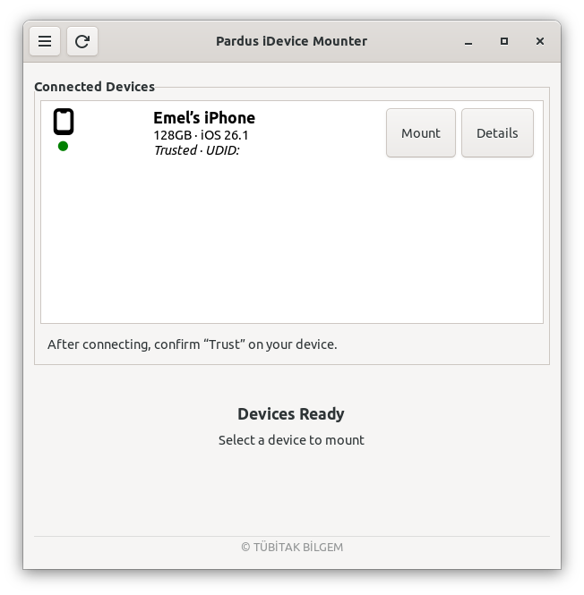

# Pardus iDevice Mounter


[🇹🇷](./README_TR.md) | [🇬🇧](./README.md)

## Introduction

Pardus iDevice Mounter is a simple application that helps you connect and access files on your iPhone or iPad from your Linux computer. You can just plug in your device, click mount, and browse your files like a regular folder.


## Features

- Automatic device detection
- Detailed device information display
- Easy mount/unmount operations
- Automatic cleanup of stale mount points

## Installation

### Requirements

Before installing Pardus iDevice Mounter, ensure your system meets the following requirements:

- `python3`: *Pardus iDevice Mounter is built with Python3*
- `python3-gi`: *Allows Python to use GTK and GNOME libraries.*
- `gir1.2-gtk-3.0`: *Provides the library for building windows and buttons.*
- `gir1.2-glib-2.0`: *GLib bindings for Python.*
- `libimobiledevice-utils`: *Tools for communicating with iOS devices*
- `ifuse`: *FUSE module for mounting iOS device filesystems.*
- `fuse`: *Filesystem in Userspace support.*
- `xdg-utils`: *Desktop integration utilities.*

### Usage

  - __From Package Manager__

    ```bash
    sudo apt install pardus-idevice-mounter
    ```

  - __From Source__

    ```
    # Clone the repository
    git clone https://github.com/pardus/pardus-idevice-mounter

    # Navigate to the project directory
    cd pardus-idevice-mounter

    # Install dependencies
    sudo apt install python3 python3-gi gir1.2-gtk-3.0 gir1.2-glib-2.0 \
        libimobiledevice-utils ifuse fuse xdg-utils

    # Run the application
    python3 src/main.py

    ```
 
### Usage Guide

<p align="center">
  
</p>

 ##### Mounting a Device

  1. Launch the application
  2. Connect your iOS device via USB
  3. If prompted, unlock your device and tap "Trust This Computer"
  4. Click the scan button, your device will appear in the device list
  5. Click the "Mount" button next to your device
  6. The device filesystem will be mounted and opened in your file manager

 ##### Device Details

  - Select a device in the list to view detailed information with details button
  - Device details includes model, iOS version, storage capacity, battery status, serial number, and more

 ##### Unmounting a Device

  - Click the "Unmount" button to safely disconnect the device
  - Wait for the operation to complete before unplugging the USB cable

> __Notes:__
    - Make sure your device is unlocked when connecting for the first time
    - You must trust the computer on your iOS device for full access
    - Mount points are automatically created in `/run/user/<uid>/idevices/`
