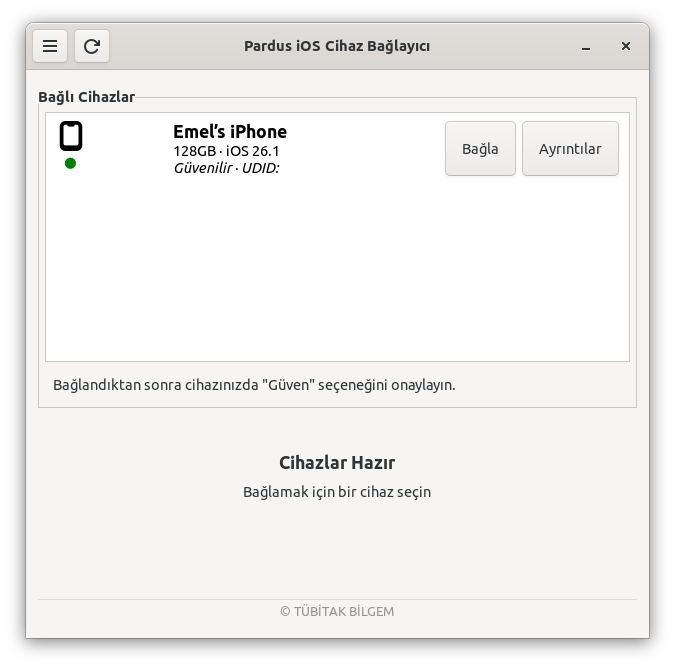

# Pardus iOS Cihaz Bağlayıcı


[🇹🇷](./README_TR.md) | [🇬🇧](./README.md)

## Giriş

Pardus iOS Cihaz Bağlayıcı, iPhone veya iPad'inizdeki dosyalara Linux bilgisayarınızdan bağlanmanıza ve erişmenize yardımcı olan basit bir uygulamadır. Cihazınızı takıp, bağla butonuna tıklayarak dosyalarınıza normal bir klasör gibi göz atabilirsiniz.


## Özellikler

- Otomatik cihaz algılama
- Detaylı cihaz bilgisi görüntüleme
- Kolay bağlama/ayırma işlemleri
- Eski bağlantı noktalarının otomatik temizlenmesi

## Kurulum

### Gereksinimler

Pardus iOS Cihaz Bağlayıcı uygulamasını kurmadan önce, sisteminizin aşağıdaki gereksinimleri karşıladığından emin olun:

- `python3`: *Pardus iOS Cihaz Bağlayıcı, Python 3 ile geliştirilmiştir*
- `python3-gi`: *Python'un GTK ve GNOME kütüphanelerini kullanmasını sağlar.*
- `gir1.2-gtk-3.0`: *Pencere ve buton oluşturmak için kütüphane sağlar.*
- `gir1.2-glib-2.0`: *Python için GLib bağlantıları.*
- `libimobiledevice-utils`: *iOS cihazlarıyla iletişim için araçlar*
- `ifuse`: *iOS cihaz dosya sistemlerini bağlamak için FUSE modülü.*
- `fuse`: *Kullanıcı Alanında Dosya Sistemi desteği.*
- `xdg-utils`: *Masaüstü entegrasyon araçları.*

### Kullanım

  - __Paket Yöneticisinden__

    ```bash
    sudo apt install pardus-idevice-mounter
    ```

  - __Kaynak Koddan__

    ```
    # Depoyu klonlayın
    git clone https://github.com/pardus/pardus-idevice-mounter

    # Proje dizinine gidin
    cd pardus-idevice-mounter

    # Bağımlılıkları yükleyin
    sudo apt install python3 python3-gi gir1.2-gtk-3.0 gir1.2-glib-2.0 \
        libimobiledevice-utils ifuse fuse xdg-utils

    # Uygulamayı çalıştırın
    python3 src/main.py

    ```

### Kullanım Kılavuzu

<p align="center">
  
</p>

 ##### Cihaz Bağlama

  1. Uygulamayı başlatın
  2. iOS cihazınızı USB ile bağlayın
  3. İstenirse, cihazınızın kilidini açın ve "Bu Bilgisayara Güven"e dokunun
  4. Tarama butonuna tıklayın, cihazınız cihaz listesinde görünecektir
  5. Cihazınızın yanındaki "Bağla" butonuna tıklayın
  6. Cihaz dosya sistemi bağlanacak ve dosya yöneticinizde açılacaktır

 ##### Cihaz Detayları

  - Cihazı listeden seçerek ayrıntılar butonu ile seçili cihaz ile ilgili detayları görüntüleyin
  - Cihaz detayları model, iOS sürümü, depolama kapasitesi, pil durumu, seri numarası ve daha fazlasını içerir

 ##### Cihazı Ayırma

  - Cihazı güvenli bir şekilde ayırmak için "Ayır" butonuna tıklayın
  - USB kablosunu çıkarmadan önce işlemin tamamlanmasını bekleyin

> __Notlar:__
    - İlk bağlandığınızda cihazınızın kilidinin açık olduğundan emin olun
    - Tam erişim için iOS cihazınızda bilgisayara güvenmelisiniz
    - Bağlantı noktaları otomatik olarak `/run/user/<uid>/idevices/` içinde oluşturulur


